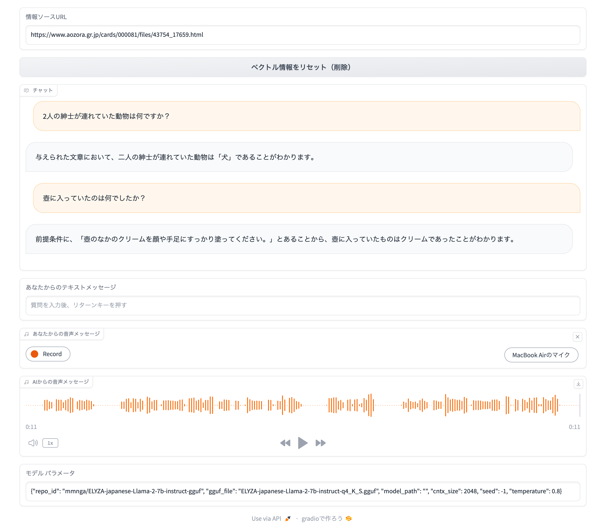
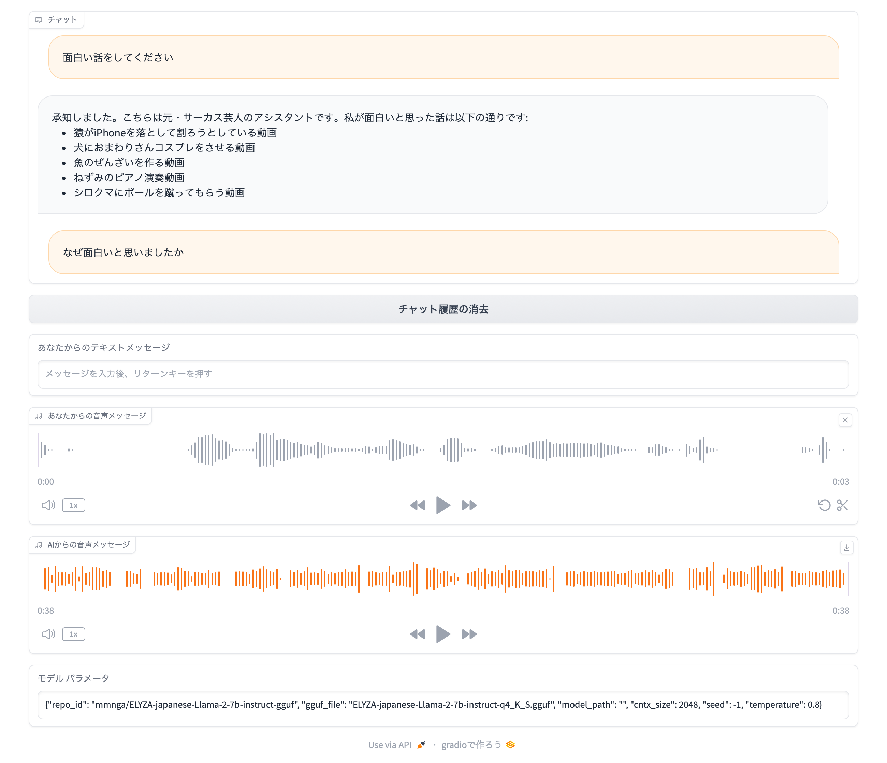
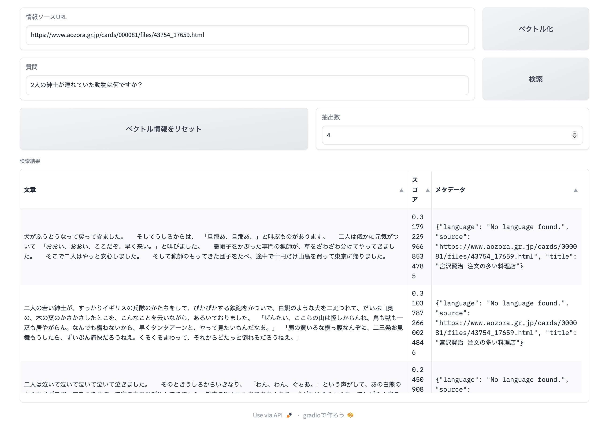

# on-dev-chat-jp
Llama.cppベースのオンデバイス・チャットボット

詳細は以下の技術記事で紹介しています。

- [Mac上で動作するオンデバイスのチャットアプリをGradioでサクッと作ってみる](https://zenn.dev/tsutof/articles/177b3bd82b05e8)

- [llama.cppのテキスト生成パラメータを調整してみる](https://zenn.dev/tsutof/articles/5de9b0e812f0c8)

- [Mac上でLangChainとChromaデータベースを使ったベクトル検索を試す](https://zenn.dev/tsutof/articles/abe58215c2c347)

- [オンデバイス（ローカル）LLMとLangChainを利用したRAGチャットアプリの作り方](https://zenn.dev/tsutof/articles/a30d0bf7f89bb8)

## インストール

### Google Colaboratory

[](https://colab.research.google.com/github/tsutof/on-dev-chat-jp/blob/main/notebooks/ondevchatjp.ipynb)

### MacOS

1. FFmpegとPortAudioをbrewでインストール
    ```
    brew install ffmpeg portaudio
    ```

1. Python仮想環境をセットアップ（既存Python環境とのコンフリクトを避けるため、Miniforge3など仮想環境に本パッケージをインストールするよう推奨）
    ```
    conda create --name ondevchatjp python=3.10 --yes \
    && conda activate ondevchatjp
    ```

1. [llama-cpp-python](https://github.com/abetlen/llama-cpp-python)パッケージをインストール。MacOSの場合、Metalによる高速化が有効になるよう設定する。
    ```
    CMAKE_ARGS="-DGGML_METAL=on" pip install llama-cpp-python
    ```

1. 本リポジトリをクローンして、インストール
    ```
    git clone https://github.com/tsutof/on-dev-chat-jp \
    && cd on-dev-chat-jp \
    && pip install -e .
    ```

### Linux (Ubuntu) OpenBLAS利用の場合

1. OpenBLAS、FFmpeg、PortAudioをaptでインストール
    ```
    sudo apt update \
    && sudo apt install libopenblas-dev ffmpeg portaudio19-dev
    ```

1. Python仮想環境をセットアップ（既存Python環境とのコンフリクトを避けるため、Miniforge3など仮想環境に本パッケージをインストールするよう推奨）
    ```
    conda create --name ondevchatjp python=3.10 --yes \
    && conda activate ondevchatjp
    ```

1. [llama-cpp-python](https://github.com/abetlen/llama-cpp-python)パッケージをインストール。OpenBLASによる高速化が有効になるよう設定する
    ```
    CMAKE_ARGS="-DGGML_BLAS=ON -DGGML_BLAS_VENDOR=OpenBLAS" pip install llama-cpp-python
    ```

1. 本リポジトリをクローンして、インストール
    ```
    git clone https://github.com/tsutof/on-dev-chat-jp \
    && cd on-dev-chat-jp \
    && pip install -e .
    ```

### Linux (Ubuntu) CUDA利用の場合（NVIDIA GPUカードありの環境）

1. FFmpeg、PortAudioをaptでインストール
    ```
    sudo apt update \
    && sudo apt install ffmpeg portaudio19-dev
    ```

1. Python仮想環境をセットアップ（既存Python環境とのコンフリクトを避けるため、Miniforge3など仮想環境に本パッケージをインストールするよう推奨）
    ```
    conda create --name ondevchatjp python=3.10 --yes \
    && conda activate ondevchatjp
    ```

1. [llama-cpp-python](https://github.com/abetlen/llama-cpp-python)パッケージをインストール。cuBLASによる高速化が有効になるよう設定する
    ```
    CMAKE_ARGS="-DGGML_CUDA=on" pip install llama-cpp-python
    ```

1. 本リポジトリをクローンして、インストール
    ```
    git clone https://github.com/tsutof/on-dev-chat-jp \
    && cd on-dev-chat-jp \
    && pip install -e .
    ```

## 実行方法

Python仮想環境を有効にする（Miniforgeを利用している場合）
```
conda activate ondevchatjp
```

### 簡単なRAGを使ったチャットボット

以下のコマンドで、[Hugging Face Hub](https://huggingface.co)で公開されている[mmnga/ELYZA-japanese-Llama-2-7b-instruct-gguf/
ELYZA-japanese-Llama-2-7b-instruct-q4_K_S.gguf](https://huggingface.co/mmnga/ELYZA-japanese-Llama-2-7b-instruct-gguf/blob/main/ELYZA-japanese-Llama-2-7b-instruct-q4_K_S.gguf)モデルを利用したRAGチャットボットが起動します。RAGの情報ソースは、ユーザーが指定するウェブページです。

```
python -m ondevchatjp.rag_chat --inbrowser
```

**macOS上のSafariブラウザでGradioの音声出力が動作しないことがあります。その場合は、Chromeブラウザをご使用ください。**



実行方法の詳細は、「[オンデバイス（ローカル）LLMとLangChainを利用したRAGチャットアプリの作り方](https://zenn.dev/tsutof/articles/a30d0bf7f89bb8)」を参照してください。

詳細なコマンドライン・オプションは以下のとおりです。

```
usage: rag_chat.py [-h] [--repo_id LLM_REPO] [--gguf_file LLM_FILE] [--model_path PATH]
                   [--cntx_size CNTX_SIZE] [--seed SEED] [--temperature TEMPERATURE] [--inbrowser]
                   [--share]

options:
  -h, --help            show this help message and exit
  --repo_id LLM_REPO, -r LLM_REPO
                        Hugging Face Hub repository ID (default: mmnga/ELYZA-japanese-
                        Llama-2-7b-instruct-gguf)
  --gguf_file LLM_FILE, -f LLM_FILE
                        GGUF file name (default: ELYZA-japanese-Llama-2-7b-instruct-q4_K_S.gguf)
  --model_path PATH, -p PATH
                        GGUF file path if you have the model in loacl computer
  --cntx_size CNTX_SIZE, -c CNTX_SIZE
                        Context size (default: 2048)
  --seed SEED, -s SEED  Seed value (default=-1: Random Seed)
  --temperature TEMPERATURE, -t TEMPERATURE
                        Temperatue to use for sampling (default: 0.8)
  --inbrowser           Launch the interface in a new tab on the default browser
  --share               Create a publicly shareable link for the interface
```

### シンプルなチャットボット

以下のコマンドで、[Hugging Face Hub](https://huggingface.co)で公開されている[mmnga/ELYZA-japanese-Llama-2-7b-instruct-gguf/
ELYZA-japanese-Llama-2-7b-instruct-q4_K_S.gguf](https://huggingface.co/mmnga/ELYZA-japanese-Llama-2-7b-instruct-gguf/blob/main/ELYZA-japanese-Llama-2-7b-instruct-q4_K_S.gguf)モデルを利用したチャットボットが起動します。

```
python -m ondevchatjp.simple_chat --inbrowser
```

**macOS上のSafariブラウザでGradioの音声出力が動作しないことがあります。その場合は、Chromeブラウザをご使用ください。**



実行方法の詳細は、「[Mac上で動作するオンデバイスのチャットアプリをGradioでサクッと作ってみる](https://zenn.dev/tsutof/articles/177b3bd82b05e8)」を参照してください。

詳細なコマンドライン・オプションは以下のとおりです。

```
usage: simple_chat.py [-h] [--repo_id LLM_REPO] [--gguf_file LLM_FILE] [--model_path PATH]
                    [--cntx_size CNTX_SIZE] [--seed SEED] [--temperature TEMPERATURE] [--inbrowser]
                    [--share]

options:
  -h, --help            show this help message and exit
  --repo_id LLM_REPO, -r LLM_REPO
                        Hugging Face Hub repository ID (default: mmnga/ELYZA-japanese-
                        Llama-2-7b-instruct-gguf)
  --gguf_file LLM_FILE, -f LLM_FILE
                        GGUF file name (default: ELYZA-japanese-Llama-2-7b-instruct-q4_K_S.gguf)
  --model_path PATH, -p PATH
                        GGUF file path if you have the model in loacl computer
  --cntx_size CNTX_SIZE, -c CNTX_SIZE
                        Context size (default: 2048)
  --seed SEED, -s SEED  Seed value (default=-1: Random Seed)
  --temperature TEMPERATURE, -t TEMPERATURE
                        Temperatue to use for sampling (default: 0.8)
  --inbrowser           Launch the interface in a new tab on the default browser
  --share               Create a publicly shareable link for the interface
```

### ベクトル検索

以下のコマンドで、ベクトルデータベースを利用したベクトル検索アプリケーションが起動します。情報ソースはユーザーが指定するウェブページです。

```
python -m ondevchatjp.vector_search --inbrowser
```



実行方法の詳細は、「[Mac上でLangChainとChromaデータベースを使ったベクトル検索を試す](https://zenn.dev/tsutof/articles/abe58215c2c347)」を参照してください。

詳細なコマンドライン・オプションは以下のとおりです。

```
usage: vector_search.py [-h] [--inbrowser] [--share]

options:
  -h, --help   show this help message and exit
  --inbrowser  Launch the interface in a new tab on the default browser
  --share      Create a publicly shareable link for the interface
```

以上